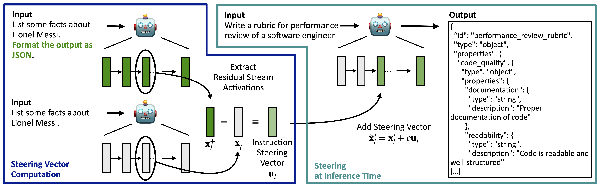

# Improving Instruction-Following in Language Models through Activation Steering

This repository contains the code for the paper **“Improving Instruction-Following in Language Models through Activation Steering,”** presented at ICLR 2025.

Links to the paper: [[arXiv]](https://arxiv.org/abs/2410.12877) [[OpenReview]](https://openreview.net/forum?id=wozhdnRCtw)


## Method

We apply activation steering to improve a language model’s instruction-following behavior. 
Our method computes a steering vector as the difference in activations obtained on paired inputs — with and without a particular instruction. During inference, this steering vector is added to the model’s residual stream to guide the generation toward satisfying the desired constraint (e.g., specific format or length).



## Repository Structure

The repository is organized around the three main experiments from the paper (format, length, and word-specific instructions), plus an additional “composition” folder for multi-instruction steering. For parameter configuration, we use [Hydra](https://hydra.cc), with config files for each experiment are stored in dedicated subdirectories under `config/`. We use the IFEval evaluation code from the [official repo](https://github.com/google-research/google-research/tree/master/instruction_following_eval).

Below is an overview of the folder structure.

```
.
├── config                 # contains all '.yaml' configs
├── format                 # scripts for format instructions
│   ├── compute_representations.py
│   ├── find_best_layer.py
│   ├── compute_response_perplexity.py
│   ├── evaluate.py
│   ├── precompute_ivs.py
│   ├── load_results.py
├── keywords               # scripts for word-specific instructions
│   ├── compute_representations.py
│   ├── compute_perplexity.py
│   ├── evaluate.py
│   └── load_results.py
├── length                 # scripts for length instructions
│   ├── compute_representations.py
│   ├── evaluate.py
│   └── load_results.py
├── composition            # scripts for multi-instruction steering
│   ├── evaluate_format_plus_length.py
│   └── load_results.py
├── utils                  # helper functions
├── ifeval_scripts         # official IFEval scripts
├── requirements.txt
└── ...
```


## Installation

Install the required modules. 
```bash
pip install -r requirements.txt
```


## File Description

### Format Instructions

1.	Compute Instruction Representations
    -	Script: `format/compute_representations.py`
    -	Config: `config/format/compute_representations.yaml`
    -	Description: Runs the model on pairs of inputs (with and without instructions) and stores the hidden states of the last token for each layer.
2.	Layer Search for Steering
    - Script: `format/find_best_layer.py`
    - Config: `config/format/find_best_layer.yaml`
    - Description: Runs the model on validation data, performs steering at multiple layers, and stores the outputs.
3. Compute Perplexity of Model Responses
    - Script: `format/compute_response_perplexity.py`
    - Description: Loads validation results, computes perplexity for each model response using GPT-2 as a quality proxy, and saves the updated results to new JSONL files.
4.	Pre-compute Instruction Steering Vectors
    - Script: `format/pre_compute_ivs.py`
    - Description: Computes the instruction vectors at the optimal steering layer based on the representations and validation scores.
5. Evaluate Format Instructions
    - Script: `format/evaluate.py`
    - Config: `config/format/evaluation.yaml`
    - Description: Evaluates the model on a subset of the IFEval dataset. For cross-model experiments, set `model_name` to `gemma-2-2b` or `gemma-2-9b` and enable the `cross-model` flag. Cross-model experiments require representations from the instruction-tuned counterpart.


### Length Instructions
1. Compute Representations
    - Script: `length/compute_representations.py`
    - Config: `config/length/compute_representations.yaml`
    - Description: Computes representations for length constraints and stores them in `length/representations/`.
2.	Evaluate Length Instructions
    - Script: `length/evaluate.py`
    - Config: `config/length/evaluation.yaml`
    - Description: Evaluates the model on length constraints, analogous to the format instructions evaluation.


### Word-Specific Instructions
1.	Compute Keyword Representations
    - Script: `keywords/compute_representations.py`
    - Config: `config/keywords/compute_representations.yaml`
    - Description: Computes representations for keyword constraints using base queries from `data/ifeval_wo_instructions.jsonl`  and stores them in `keywords/representations/`.
2. Compute Perplexity of Model Responses
    - Script: `keywords/compute_response_perplexity.py`
    - Description: Loads validation results for keyword instructions, computes perplexity for each model response and saves the updated results to new JSONL files.
3.	Evaluate Keyword Instructions
    - Script: `keywords/evaluate.py`
    - Config: `config/keywords/evaluation.yaml`
    - Description: Evaluates keyword inclusion or exclusion. Specify `specific_constraint` as `ifeval_include` (for inclusion) or `ifeval_exclude` (for exclusion). To evaluate on validation data, use `validation`.


### Multi-instruction Steering

1. Evaluate Format + Length Instructions
    - Script: `composition/evaluate_format_plus_length.py`
    - Config: `config/composition/evaluation.yaml`
    - Description: Evaluates the model on format and length instructions simultaneously. Requires representations from both `length/compute_length_representations.py` and `format/compute_representations.py`.


## Responsible AI Considerations
[This transparency note](TODO) outlines our responsible AI considerations. Our method was tested using open-source models such as Phi 3.5, Gemma, and Mistral, evaluated on the IFEval dataset for instruction adherence and text quality, with GPT-4o assisting in quality scoring. Although promising, the method faces limitations, including potential reductions in text quality and incomplete guarantee of instruction adherence, especially in complex scenarios. Users are advised to carefully balance instruction following with text quality and integrate this approach with fine-tuning or responsible AI mitigations, like content filters, to minimize risks, including the potential generation of harmful content. The method, developed primarily for research purposes in English, requires further validation for broader commercial applications.


## Citation

If you use this code in your research, please consider citing us:

```
@inproceedings{
stolfo2025improving,
title={Improving Instruction-Following in Language Models through Activation Steering},
author={Alessandro Stolfo and Vidhisha Balachandran and Safoora Yousefi and Eric Horvitz and Besmira Nushi},
booktitle={The Thirteenth International Conference on Learning Representations},
year={2025},
url={https://openreview.net/forum?id=wozhdnRCtw}
}
```

## License

This project is licensed under the MIT License. You are free to modify and adapt it for your own use.

## Contact

For questions or issues, please open an issue on this repository or reach out to [stolfoa@ethz.ch](mailto:stolfoa@ethz.ch) and [besmira.nushi@microsoft.com](mailto:besmira.nushi@microsoft.com).

## Contributing
This project welcomes contributions and suggestions. Most contributions require you to
agree to a Contributor License Agreement (CLA) declaring that you have the right to,
and actually do, grant us the rights to use your contribution. For details, visit
https://cla.microsoft.com.

When you submit a pull request, a CLA-bot will automatically determine whether you need
to provide a CLA and decorate the PR appropriately (e.g., label, comment). Simply follow the
instructions provided by the bot. You will only need to do this once across all repositories using our CLA.

This project has adopted the [Microsoft Open Source Code of Conduct](https://opensource.microsoft.com/codeofconduct/).
For more information see the [Code of Conduct FAQ](https://opensource.microsoft.com/codeofconduct/faq/)
or contact [opencode@microsoft.com](mailto:opencode@microsoft.com) with any additional questions or comments.

## Trademarks
Trademarks This project may contain trademarks or logos for projects, products, or services. Authorized use of Microsoft trademarks or logos is subject to and must follow [Microsoft’s Trademark & Brand Guidelines](https://www.microsoft.com/en-us/legal/intellectualproperty/trademarks). Use of Microsoft trademarks or logos in modified versions of this project must not cause confusion or imply Microsoft sponsorship. Any use of third-party trademarks or logos are subject to those third-party’s policies.


